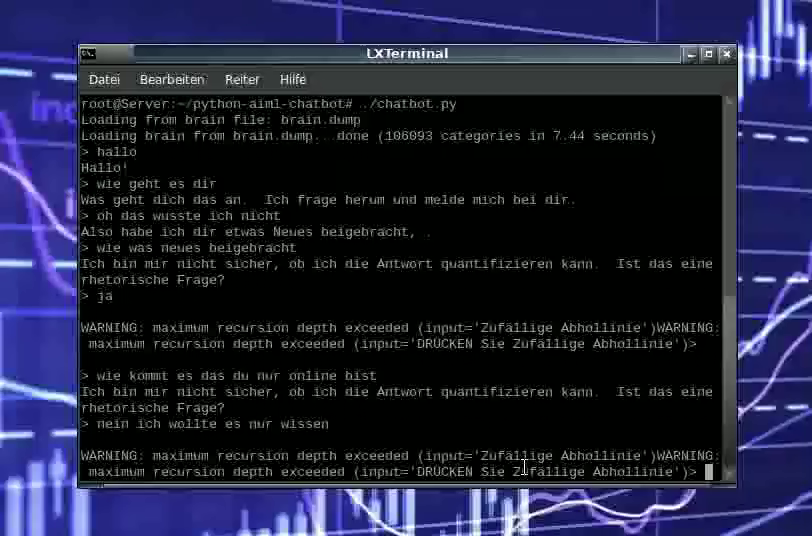

## Python AIML-Chatbot

Neu ist die Übersetzung der im Text als "aiml-en-us-foundation-alice" beschrieben Dateinen zu sozusagen "aiml-de-de-foundation-alice", sich daraus die Deutschesprache als fertig gestellte Übersetzung ergibt. 
Übersetzungsfehler bzw. Grammatikfehler sind möglich, wodurch es etwas missverständlich dessen Antwort wirken k&ouml;nnte. 

Darüber hinaus habe ich ein Video im Verzeichnis _Video angefertigt, das den Chatbot im Betrieb etwas zeigen soll. 

 "Das kurze Video"

 "Das kurze Video"

Vor einer Weile schrieb ich ein kurzes Tutorial über das Erstellen eines AIML Chatbot und seine text-Ausgabe

via espeak (https://iniy.org/?p=68).


Nach Jahren stolperte ich über diesen Beitrag wieder und jetzt ist hier der zweite Teil, die Lasten der AI-Stiftung ist A. L. I. C. E.

AIML aus http://www.alicebot.org/aiml.html .


Um ehrlich zu sein, war ich ein wenig darüber überrascht, wie leicht diese zu finden sind und Dokumentation gibt es auf der

net, man diese einfachen aiml-Dateien ausführen. Es ist ein bisschen schwer zu finden, auf der Google Code-Seite:

https://code.google.com/archive/p/aiml-en-us-foundation-alice/


Aber diese AIMLs sind für die Pandorabots online-plattform optimiert, und ich wollte nur etwas spielen, um 

ein wenig mit diesem Zeug lokal vertraut zu sein.


Also hier ist ein Repository mit aiiml-Dateien im Lieferumfang mit enthalten:


- Basiert auf aiml-de-de-foundation-alice-1.9 zip-Datei von der AI Foundation-google code

- entfernte Pandorabots bestimmte Syntax

- Hinzugefügt std-startup.aiml mit den (meiner Meinung) richtigen laden der aiml-Dateien. 

- minimale Version eines Python Chatbot's. 


## Setup


Klonenen des git 


```

git clone https://github.com/dwhr-pi/python-aiml-chatbot.git

```


Erfordert Python3 ist (aber die Portierung des minimal-Skript zu python2 ist sehr einfach)


```

pip3 install python-aiml

```

Dann einfach im Terminal nachfolgend ausführen, um den Pfad zu dem Ordner der python-aiml-chatbot zu ändern:


```

cd python-aiml-chatbot

```


Und den Chatbot im Terminal starten mit:

```

./chatbot.py

```

## Wohin Sie von hier aus gehen.


Dieses minimal-Skript, nicht implementiert ist ein Präprozessor und aufgrund der Entfernung des Codes von einigen Pandorabots. 

Besondere Syntax, die es geben könnte einige merkwürdige Antworten, aber es ist ein Ausgangspunkt.


Fügen Sie Ihre eigenen AIML-Dateien auf der Unterseite der std-startup.aiml-Datei (so haben Sie höchste Priorität) mit ein. 

Und experimentieren damit, um die Herstellung des Bots etwas schlauer zu gestalten. 


Einschließlich der espeak-Ausgabe von meinem anderen blog-post, der auch Spaß machen könnte, (https://iniy.org/?p=68).


## Allgemeine Dokumentation (von der AI Foundation, google code)


Da hatte ich eine harte Zeit auf der Suche und nach dem laden, um die Informationen, die ich auch diese hier im repo veröffendliche. 


### Über die A. L. I. C. E. AIML-Dateien


Die aiml-en-us-foundation-alice enthalten eine Reihe von Kategorien mit doppelten Muster. Je nach AIML-interpreter verwendet, die Duplikate sind unterschiedlich gehand habt. 


Auf Pandorabots ist die Regel: Die Dateien werden in alphabetischer Reihenfolge der Dateien geladen, von Oben aus der Liste (unter dem "AIML-Dateien" Abschnitt) bis zu der Unterseite. Wenn eine Kategorie geladen wurde, die das gleiche Muster Pfad (d.h. gleicher input Muster, Muster und Thema-Muster- hat, erinnern Sie sich, dass &lt;that&gt; und &lt;topic&gt; eingestellt sind implizit), dann Pandorabots die frühere Kategorie verwirft und wählt die Antwort Vorlage aus dem zuletzt geladenen Kategorie aus.


Um ein Beispiel zu geben: Angenommen, eine Datei A.aiml hat eine category &lt;category&gt; &lt;pattern&gt;TEST&lt;/pattern&gt; &lt;template&gt;Das ist die Antwort von Datei-A.&lt;/template&gt; &lt;/category&gt; und eine Datei B.aiml hat eine category &lt;category&gt; &lt;pattern&gt;TEST&lt;/pattern&gt; &lt;template&gt;Das ist die Antwort von Datei B.&lt;/template&gt; &lt;/category&gt;


Vorausgesetzt, die Dateien wurden in alphabetischer Reihenfolge geladen, erst die A.aiml, bevor die B.aiml geladen wird. Dann ist die Antwort an des Eingang "Test" sollte dann "Dies ist die Antwort von Datei B." sein. 

A. L. I. C. E. AIML Datei-Bestellung


Die A. L. I. C. E. AIML-Dateien in aiml-en-us-foundation-alice geladen werden soll, in der folgenden Reihenfolge:


- Laden Sie zunächst die Sichere Reduktion Dateien reducation0.safe.aiml,...,reduction4.safe.aiml und reductuions.update.aiml.

- Zweitens, laden Sie die Mindpixel mp0-Dateien.aiml,...,mp6.aiml.

- Laden Sie dann alle verbleibenden AIML-Dateien.

- Pandorabots wird immer die Datei update.aiml als die Letzte Datei laden.


### AIML nutzt einem preprocessing-Schritt Normalisierung genannt.


Dieses AIML-Set ist entwickelt, um mit dem Standard-AIML Präprozessor-geliefert mit Pandorabots.com.


Der Präprozessor


Korrigiert einige Rechtschreibfehler und Redensarten (z.B. "wanna" --&gt; "wollen")

Ersatz Wörter für gemeinsame emoticons (z.B. ":-)" --&gt; "LÄCHELN")

Erweitert Kontraktionen (z.B. "nicht" --&gt; "nicht")

Entfernt intra-Satz Satzzeichen (z.B. "Dr. Wallace lebt auf St. John St. --&gt; "Dr Wallace lebt in der St. John St.")


Wir verweisen auf die obige substitutions Schritte als Normalisierung.


Der Letzte Schritt der Vorverarbeitung


Teilt Sätze basierend auf vordefinierten Zeichen ".", "!", ";" und "?"


Alle diese preprocessing-Schritte werden in der Konfigurationsdatei definiert. Neben der Konfigurationsdatei


Definiert Substitutionen für &lt;gender&gt;, &lt;person&gt; und &lt;person2-&gt;


Der Präprozessor normalisiert die Eingänge des Bots durch das laufen und durch eine Reihe von Substitutionen, dann teilt er sich den Eingang in den Sätzen und speist diese in den Bot.